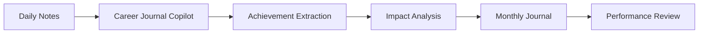

# Career Journal Copilot


An AI-powered career journaling assistant that turns rough daily notes into structured, performance-review-ready achievements.

---

## The Problem

Most people forget their best work long before performance review season.

Career Journal Copilot helps users capture achievements as they happen and build a searchable record of impact throughout the year.

---

## Example

### Input

```text
Talked to finance.
Fixed some reporting issues.
Worked on a new AI idea.
```

### Output


The assistant automatically:

✅ Separates achievements

✅ Identifies impact

✅ Categorizes work

✅ Suggests evidence

✅ Creates review-ready entries

<details>
<summary>View Full Example Output</summary>

### Entry 1

**Title:** Aligned with Finance on Topics

**Impact:** Improved alignment and understanding between teams.

**Category:** Collaboration

---

### Entry 2

**Title:** Fixed Reporting Issues

**Impact:** Improved data accuracy and reliability.

**Category:** Operational Excellence

---

### Entry 3

**Title:** Explored New AI Idea

**Impact:** Created potential for future automation and efficiency gains.

**Category:** Innovation

</details>

---

## How It Works



---

## Key Features

- Daily achievement capture
- Impact identification
- Evidence suggestions
- Achievement categorization
- Monthly summaries
- Annual review preparation
- Career development support

---

## Design Decisions

### Why Separate Entries?

Most people combine unrelated activities.

Separating achievements creates stronger evidence and better summaries.

### Why Monthly Journals?

- Easy to maintain
- Easy to review
- Easy to summarize
- Low friction for users

### Why Focus on Impact?

Tasks describe activity.

Impact describes value.

Performance reviews focus on impact.

---

## Technology

- Microsoft 365 Copilot
- Copilot Studio Lite
- Prompt Engineering
- Microsoft Loop
- AI-Assisted Knowledge Management

---

## Lessons Learned

- Simplicity drives adoption.
- Small achievements matter.
- Monthly journals work better than structured databases for most users.
- AI is most valuable when it helps identify impact, not just rewrite text.

---

## Future Roadmap

### Current

✅ Achievement capture

✅ Impact identification

✅ Monthly journaling

✅ Performance review support

### Future

- Automated reminders
- Activity-based achievement suggestions
- AI-generated annual reviews
- Career growth insights

---

## Skills Demonstrated

- AI Product Design
- Prompt Engineering
- UX Design
- Knowledge Management
- Business Process Improvement
- AI-Assisted Productivity

---

> [!IMPORTANT]
> This repository is a personal portfolio case study.
>
> All examples, workflows, screenshots, prompts, and sample data are fictional and provided for demonstration purposes only.
>
> No confidential information, proprietary business data, customer data, employee information, or employer intellectual property is included in this repository.
