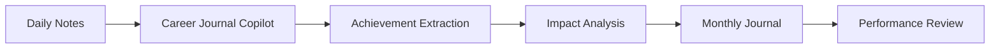

# Career Journal Copilot


A personal AI career coach that helps professionals capture accomplishments, identify impact, document learning, and build performance-review-ready career records throughout the year.

---

## The Problem

Most people forget their best work long before performance review season.

Career Journal Copilot acts as a personal AI career coach that helps users capture achievements, identify impact, document learning, and build a searchable record of contributions throughout the year.

---


---

## Example

### Input

```text
Talked to finance.
Fixed some reporting issues.
Worked on a new AI idea.
```

### Output

```text
Entry 1
Title: Aligned with Finance on Topics
Date: 2026-07-07
Achievement: Spoke with the finance team to discuss and clarify reporting topics.
Impact: Improved alignment and understanding between teams. Helped avoid confusion and ensure accurate work going forward.
Category: Collaboration
Evidence: Meeting notes, emails, Teams messages with finance team
Tags: finance, alignment, communication, stakeholders
```
```text
Entry 2
Title: Fixed Reporting Issues
Date: 2026-07-07
Achievement: Identified and fixed issues in reporting.
Impact: Improved data accuracy and reliability. Reduced risk of incorrect insights being shared.
Category: Operational Excellence
Evidence: Updated reports, tickets, before/after data comparison
Tags: reporting, data quality, issue resolution, accuracy
```
```text
Entry 3
Title: Explored New AI Idea
Date: 2026-07-07
Achievement: Worked on a new AI-based idea.
Impact: Created potential for automation or smarter processes. Supports innovation and future efficiency gains.
Category: Innovation
Evidence: Notes, draft concept, prototype, discussions
Tags: AI, innovation, automation, ideas
```

The assistant automatically:

✅ Separates achievements

✅ Identifies impact

✅ Categorizes work

✅ Suggests evidence

✅ Creates review-ready entries

---

## How It Works



---

## Key Features

- Daily achievement capture
- Impact identification
- Learning capture
- Evidence suggestions
- Achievement categorization
- Monthly summaries
- Annual review preparation
- Career development support

---

## Design Decisions

### Why Separate Entries?

Most people combine unrelated activities.

Separating achievements creates stronger evidence and better summaries.

### Why Monthly Journals?

- Easy to maintain
- Easy to review
- Easy to summarize
- Low friction for users

### Why Focus on Impact?

Tasks describe activity.

Impact describes value.

Performance reviews focus on impact.

---

## Concepts Demonstrated

- Prompt Engineering
- AI Coaching
- Knowledge Management
- Human-in-the-Loop AI
- User Experience Design
- Career Development Support

---

## Skills Demonstrated

- AI Product Design
- Prompt Engineering
- Knowledge Management
- Business Process Improvement
- AI-Assisted Productivity

---

> [!IMPORTANT]
> This repository is a personal portfolio case study.
>
> All examples, workflows, screenshots, prompts, and sample data are fictional and provided for demonstration purposes only.
>
> No confidential information, proprietary business data, customer data, employee information, or employer intellectual property is included in this repository.
